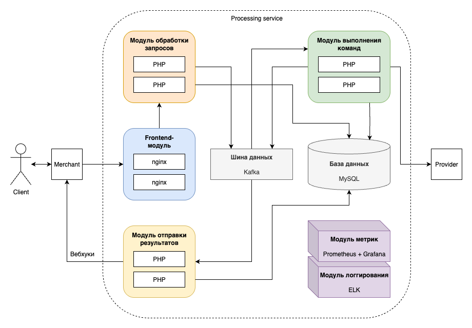

# Архитектура системы для обработки платежей

## Модули системы

1. **Frontend-модуль**: принимает HTTP-запрос, передает на выполнение приложению.
2. **Модуль обработки запросов**: валидирует запрос, аутентифицирует мерчанта, создает команду, которая отвечает на вопрос "кто и что хочет сделать", отправляет команду в очередь на выполнение. Возвращает мерчанту ответ "ваш запрос принят, ожидайте вебхук".
3. **Модуль выполнения команд**: получает команду из очереди и выполняет ее: авторизует действие мерчанта, выполняет другие проверки, создает/модифицирует сущности, взаимодействует с провайдером и т.д. Кладет результат выполнения команды в очередь на отправку результата мерчанту.
4. **Модуль отправки результатов**: получает результат выполнения команды из очереди и отправляет его мерчанту с помощью вебхука.
5. **База данных**
6. **Шина данных**
7. **Модуль метрик**: собирает, хранит и отображает различные метрики со всех остальных модулей. На диаграмме отсутствуют стрелки, чтобы не перегружать изображение.
8. **Модуль логгирования**: собирает, хранит и отображает логи со всех остальных модулей. На диаграмме отсутствуют стрелки, чтобы не перегружать изображение.

#### Почему выбран такой асинхронный подход через вебхуки?

Все определяется взаимодействием с провайдером ("авторизация" операций). Как я понял, этот процесс может быть достаточно длительным, и мы не можем гарантировать, что API-клиент дождется ответа на HTTP-запрос. С высокой вероятностью будет разрыв соединения и потеря важных данных. В свою очередь, механизм вебхуков позволяет удостовериться, что мерчант получил результат операции.

## Масштабирование системы

Все модули системы можно горизонтально масштабировать под возрастающую нагрузку. Более подробно могу рассказать на встрече.

## Ретраи в случае ошибок

Существуют разные политики ретраев, все зависит от конкретных use-кейсов и пожеланий бизнеса. На встрече можем обсудить возможные подходы. Общая архитектура системы, скорее всего, сильно не изменится.